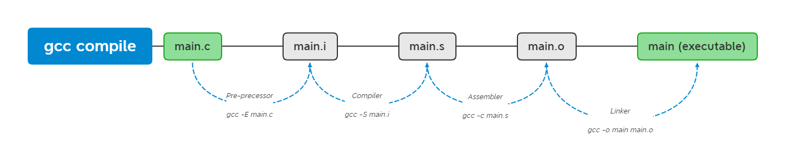

> Some useful flags for gcc and g++ explained.

<!--more-->

## The most commonly used gcc & g++ flags


Most options and flags are the same for gcc and g++. In this article, I will use examples of gcc and g++ interchangeably,  but keep in mind it most likely works for the other one as well.

  


### Errors and Warnings

Good to have:

- `-Wall`: Enables a base set of warnings generally agreed upon as being useful and easy to fix. Look at [here](https://gcc.gnu.org/onlinedocs/gcc/Warning-Options.html#Warning-Options) for the flags turned on by -Wall

- `-Wextra`: Enables an additional set of flags not covered by `-Wall`, Look at [here](https://gcc.gnu.org/onlinedocs/gcc/Warning-Options.html#Warning-Options) for the flags turned on by -Wextra

- `-Werror`: Convert warnings into errors

Optional but still good:

- `-Wno-<warning>`: To disable the warning altogether.

- `-Wno-error=<warning>`: To keep the warning enabled but not trigger an error.

- `-Wshadow`: Shadowing variables at the very least makes code difficult to read and often can be indicative of a bug because the code is not operating on the value the programmer expects. These can easily be detected by using `-Wshadow`. e.g.

  ```c++
  int variable_shadow_error_example2(void) {
    int result = 4;
  
    for (int i = 0; i < 10; i++) {
      int result = i;
      // do something with result
    }
  
    return result;
  }
  ```

  ```bash
  $ EXTRA_CFLAGS=-Wshadow make
  main.c: In function 'variable_shadow_error_example2':
  main.c:55:9: warning: declaration of 'result' shadows a previous local [-Wshadow]
       int result = i;
           ^~~~~~
  main.c:52:7: note: shadowed declaration is here
     int result = 4;
  ```

- `-Wdouble-promotion`: Warns implicit conversion from float to double.

- `Wconversion`: Warns all implicit conversions.

- `-Wformat-overflow` and `-Wformat-truncation`: Format print not matching.

- `Wundef`: Undefined macros are silently evaluating as 0 in C, this flag captures it.


### For debugging or optimization

- `-g` & `-g3`: Usually you see `-g`, but `-g3` enables a bit more for debugging, no harm to use to that.
- `-ggdb`: Produce debugging info for gdb, `-g` also works with gdb.
- `-O1`, `-O2`, `-O3`: Different level optimization, `-O3` being the highest effort. Look at [here](https://gcc.gnu.org/onlinedocs/gcc/Optimize-Options.html#Optimize-Options) for the flags turned on by -O1, -O2, -O3.
- `-Os`: optimize for speed, based on -O2, turned off a few flags for size.


### Options Controlling the Preprocessor

- `-D macro`: use compile time macros, same as write #define in src file.

  ```bash
  # e.g. -D name
  gcc -DMY_MACRO main.c -o main
  
  # e.g. -D name=value
  gcc -DMY_MACRO=1 main.c -o main
  ```

- `-include file`: same as write #include in src file.

- `-pthread`: Define additional macros required for using the POSIX threads library.


### Header files and Libraries

- `-std`: Specify language standard

  ```bash
  # e.g.
  g++ -std=c++17 main.c -o main
  ```

- `-l library`: Search the library (both static or shared) named `library` when linking.

- `-L dir`: The directories searched for the libraries specified by -l. Can also be added to `LD_LIBRARY_PATH` environment variable.
- `-I dir`: The directory searched for header files.


### Environment Variables

- `LIBRARY_PATH` is searched at compilation time for libraries.

- `LD_LIBRARY_PATH` is searched at run time for shared libraries.

- `C_INCLUDE_PATH`  is searched for c header files

- `CPLUS_INCLUDE_PATH`  is searched for c++ header files

- `CPATH` is searched for both c and c++

  

### Side Notes

- You can put all the flags you want in a file, and use `@file` to use the flags, e.g.

  ```bash
  # In 'file':
  -Wall
  -std=c99
  -Wextra
  
  # Then when compile:
  gcc @file -o main main.c
  ```

- Static vs shared library:

  - Static library ends with .a (linux) or .lin (windows), shared (also called dynamic) library ends with .so (linux) or .dll (windows).

  - Static library will be packed into executable, and no longer need it when executing. Shared library are called when executing, it's not packed into executable, so is needed at run time.

  - If two program uses a same static library, they both needed to compiled with it, and will have two copy in memory at run time. Shared library will only have one copy in memory at run time, so save memory space.

  - If static library is updated, the executable needs to be recompiled, but with shared library, the executable doesn't need to be recompiled, only need to replace the old library with new one.

  - One thing shared library is different from static library is that the executable needs to know where to find the shared library at run time, there are a few ways to do so:

    ```bash
    # 1. put in LD_LIBRARY_PATH as mentioned above
    
    # 2. copy to /lib or /usr/lib, and the loader will be able to find it
    
    # 3. add the shared library file path to /etc/ld.so.conf, then
         ldconfig
    #    this will rebuild the /etc/ld.so.cache file, so loader can find the library
    ```

    

  - Linux uses `ar` tool to generate static library, windows uses `lib.exe` to generate static library from source code.

- gcc by default will search libraries in `/lib` and `/usr/lib` 

- Use `cpp -v` to show the search path for header files


<br>
References:<br>
[https://interrupt.memfault.com/blog/best-and-worst-gcc-clang-compiler-flags](https://interrupt.memfault.com/blog/best-and-worst-gcc-clang-compiler-flags)<br>
[https://gcc.gnu.org/onlinedocs/gcc/Invoking-GCC.html](https://gcc.gnu.org/onlinedocs/gcc/Invoking-GCC.html)